# YouTube Clone

A feature-rich YouTube clone built with React, Redux, and the YouTube Data API. This application provides a seamless video streaming experience with core YouTube functionalities including video playback, search, channel pages, and user authentication.

## [Live Demo](https://react--clone-31467.web.app/)

## 🖼️ Screenshots

### Home Page
<p align="center">
  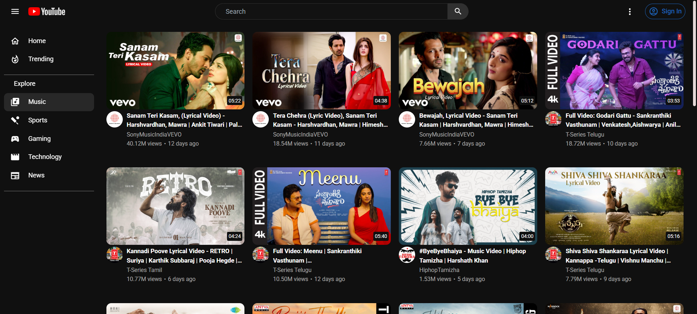
</p>

### Video Player Page
#### Video Player
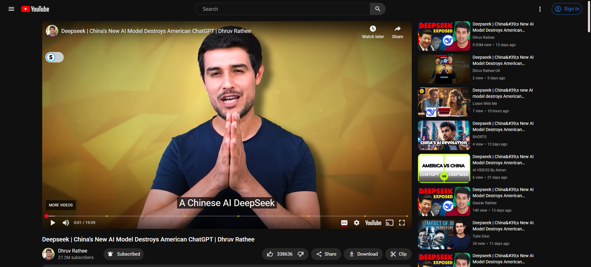

#### Video Comments
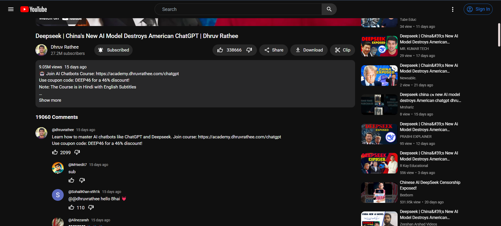

### Channel Page
#### Channel Details 
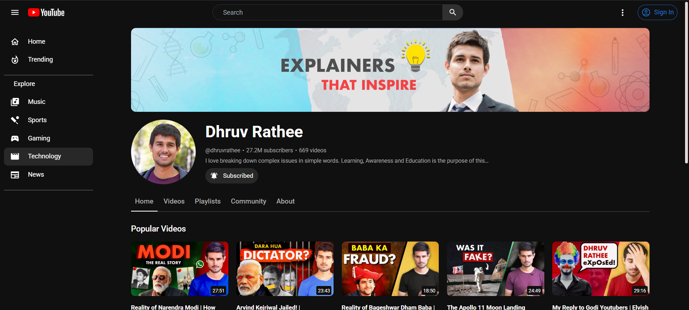

#### Channel Details Features Channels
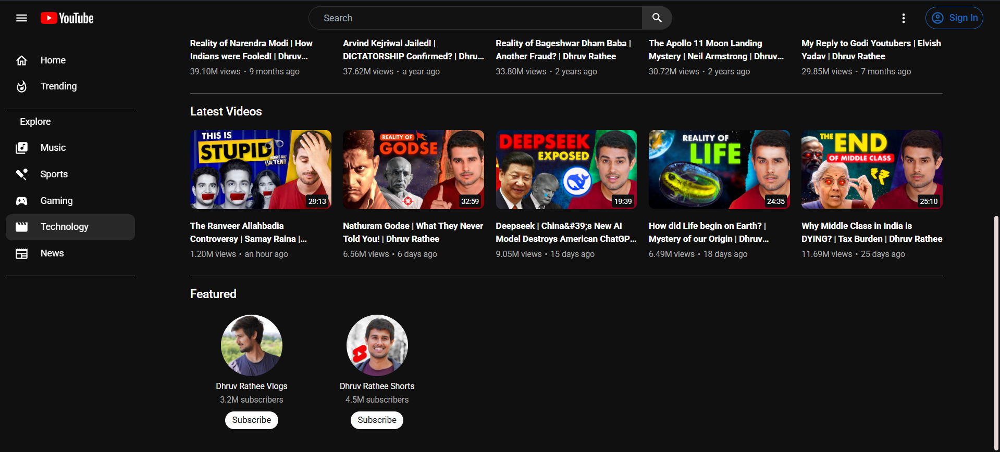

#### Channel Details Videos
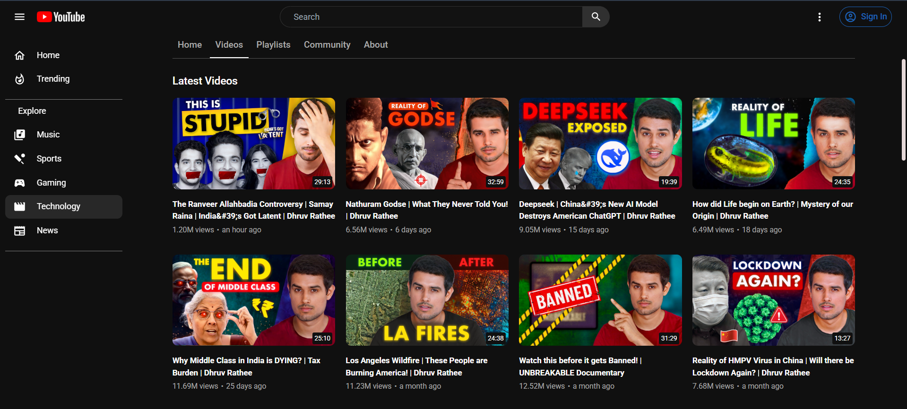

#### Channel Details Playlists
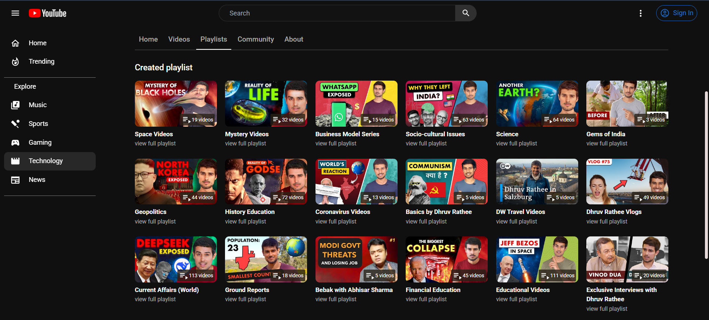

#### Channel Details Community
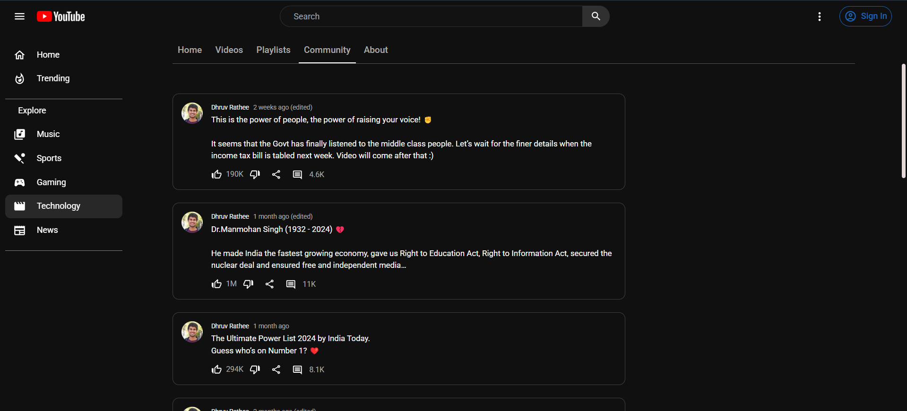

#### Channel Details About
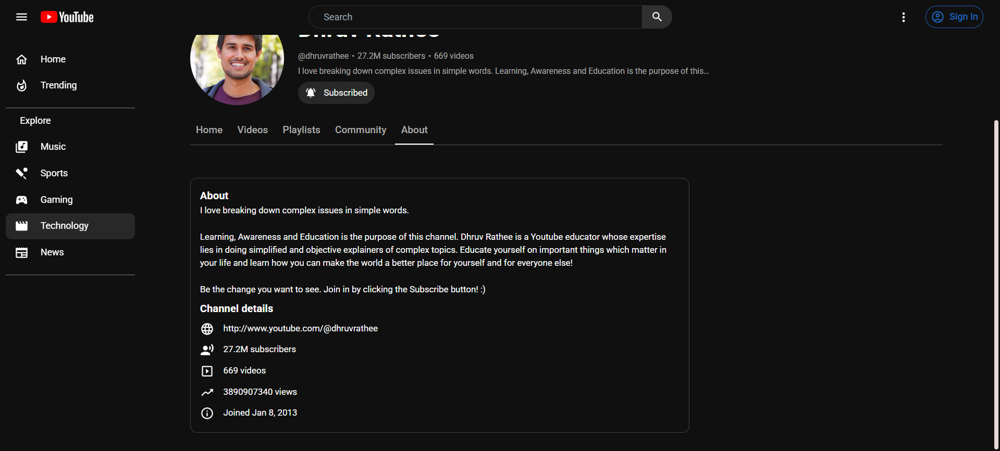

### Playlist Page
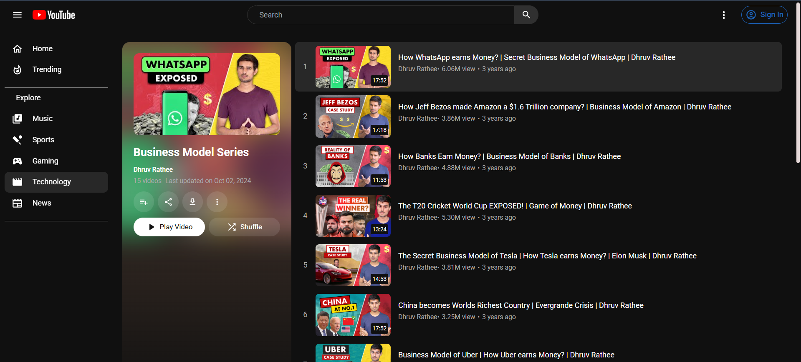

### Search Results
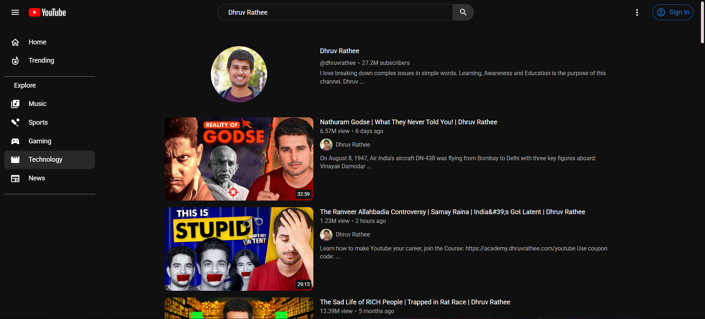

## ✨ Key Features

### 🎥 Video Experience
- **Video Playback**: Full-featured video player with custom controls
- **Related Videos**: Smart video recommendations
- **Video Info**: Detailed video descriptions, tags, and metadata
- **Engagement**: Like/dislike functionality, view counts
- **Comments**: Threaded comments with replies support

### 🔍 Search & Discovery
- **Smart Search**: Real-time search suggestions
- **Advanced Filters**: Filter by upload date, type, and duration
- **Categories**: Browse videos by categories
- **Trending Section**: Stay updated with trending content
- **Home Feed**: Personalized video recommendations

### 📺 Channel Features
- **Channel Pages**: Comprehensive channel profiles
- **About Section**: Channel description and statistics
- **Playlists**: Create and manage video playlists
- **Community**: View and engage with community posts
- **Analytics**: View channel statistics and metrics

### 👤 User Features
- **Google Authentication**: Secure login with Google OAuth
- **Subscriptions**: Subscribe to favorite channels
- **History**: Track watch history
- **Responsive Design**: Optimized for all devices
- **Dark Mode**: Eye-friendly dark theme

## 🛠️ Tech Stack

### Frontend
- **React 18**: UI development
- **Redux Toolkit**: State management
- **React Router v6**: Navigation
- **Tailwind CSS**: Styling
- **Material UI**: UI components

### Backend & APIs
- **YouTube Data API v3**: Video and channel data
- **Google OAuth 2.0**: Authentication
- **React OAuth/Google**: Google integration

### Development Tools
- **Create React App**: Project bootstrapping
- **Git**: Version control
- **npm**: Package management
- **ESLint**: Code linting
- **Prettier**: Code formatting

## 🚀 Getting Started

1. **Clone the repository**

```bash
git clone https://github.com/Shyam-Odedra/Youtube-Clone.git
cd Youtube-Clone
```

2. **Install dependencies**

```bash
npm install
```

3. **Set up environment variables**
Create a `.env` file in the root directory:
```env
REACT_APP_YOUTUBE_API_KEY=your_youtube_api_key
REACT_APP_GOOGLE_CLIENT_ID=your_google_client_id
```

4. **Start the development server**
```bash
npm start
```

Visit `http://localhost:3000` to view the application.

## 📝 Environment Variables

Required environment variables:
- `REACT_APP_YOUTUBE_API_KEY`: YouTube Data API key
- `REACT_APP_GOOGLE_CLIENT_ID`: Google OAuth client ID

## 📄 License

This project is licensed under the MIT License - see the [LICENSE](LICENSE) file for details.

## 👏 Acknowledgments

- [YouTube Data API Documentation](https://developers.google.com/youtube/v3)
- [Material-UI](https://mui.com/)
- [Tailwind CSS](https://tailwindcss.com/)
- [React Documentation](https://reactjs.org/)
- [Redux Toolkit](https://redux-toolkit.js.org/)
